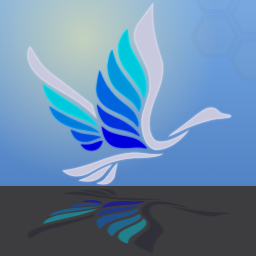

# SwanSong 

**[CurseForge](https://www.curseforge.com/minecraft/mc-mods/swansong) | [Modrinth](https://modrinth.com/mod/swansong)**

There's a swan song coming for you...

A breath of fresh air, a Right Proper shaders mod built from the ground up for Minecraft 1.7.10!  
Designed with compatibility-first, around supporting modpacks old and new, tested against era-appropriate shaderpacks.

## Compatibility

Compatible with most other popular client-side optimization and graphics mods, including but not limited to:

- FalseTweaks
- Beddium
- Right Proper Lighting Engine
- Right Proper MCPatcher
- HodgePodge
- FastCraft
- CoreTweaks
- ArchaicFix
- BugTorch
- NotFine

With expected incompatibilities with:

- OptiFine (any)
- Original ShadersMod
- MCPatcher: Forge
- Neodymium (use Beddium)
- Angelica (May work with certain modules)

## Technical

SwanSong is a standalone replacement for [ShadersMod](https://www.minecraftforum.net/forums/mapping-and-modding-java-edition/minecraft-mods/1286604-shaders-mod-updated-by-karyonix), with initial support focused on shaders that already work with [OptiFine 1.7.10_HD_U_E7](https://optifine.net/changelog?f=OptiFine_1.7.10_HD_U_E7.jar).

It is not a backport of Iris, nor a direct descendant of ShadersMod or the GLSL Shaders mod. Outside of acting as an implementation of the specification pioneered by said mods.

A few other goodies such as threaded screenshots, OptiFine-like zooming, and a faster font rendering module are included as a bonus!

## Licence

The mod was developed by `Ven` and `FalsePattern`, Copyright 2025, licensed under the [Open Software License, version 3.0](https://opensource.org/licenses/OSL-3.0).

The mod logo was designed by `Houstonruss`, with some touchups by `FalsePattern`, Copyright 2025, All Rights Reserved.

For more information, see the LICENSE file. This readme section is not a replacement for the full license text.

## Credits

Designed by Ven, written by FalsePattern

Initial testing done by, (alphabetic order):

- Bot
- Brandyn
- DarkShadow44
- Houstonruss
- Jss
- matt-159
- Rally
- UnicornBlood

Based on the work of:

- OG ShaderMod devs: (daxnitro, id_miner and karyonix)
